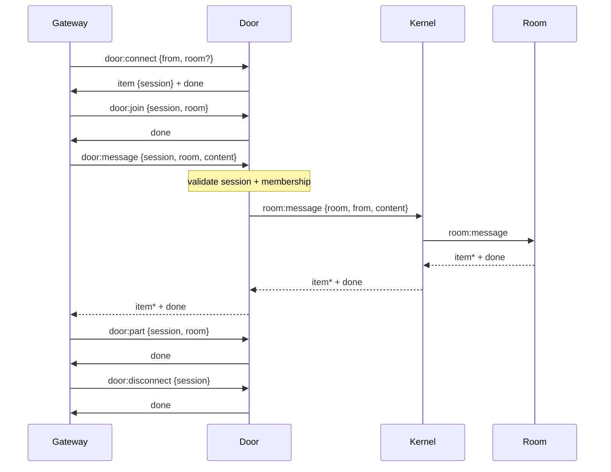
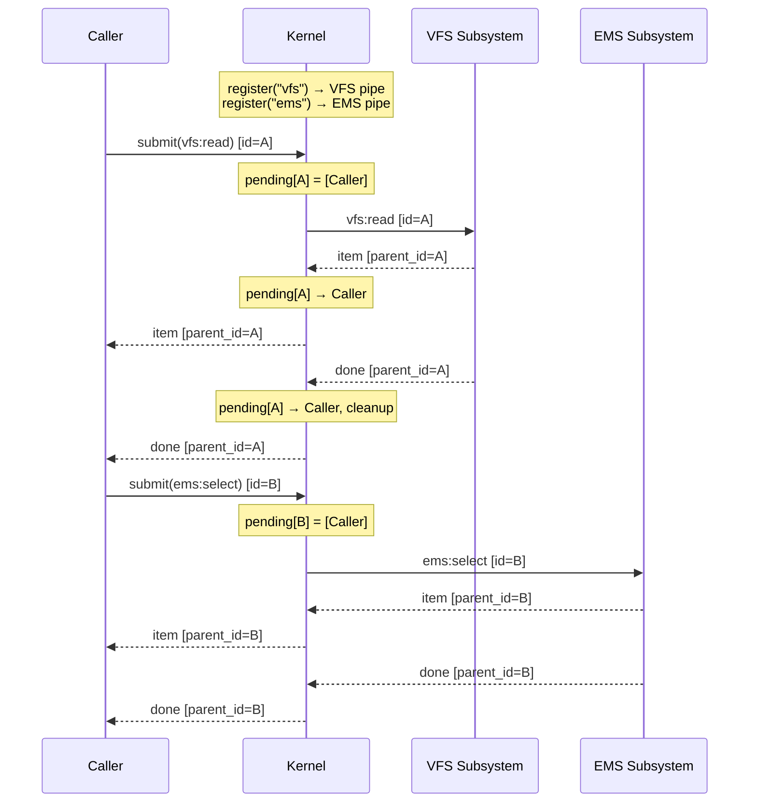
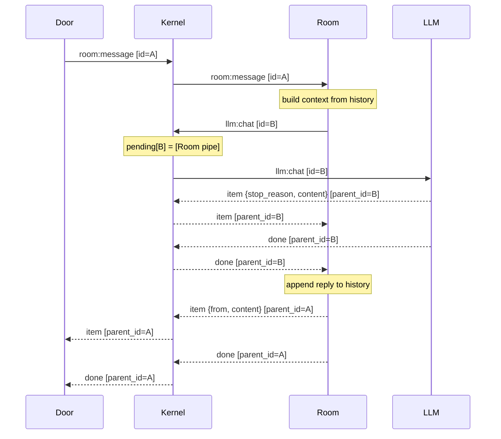
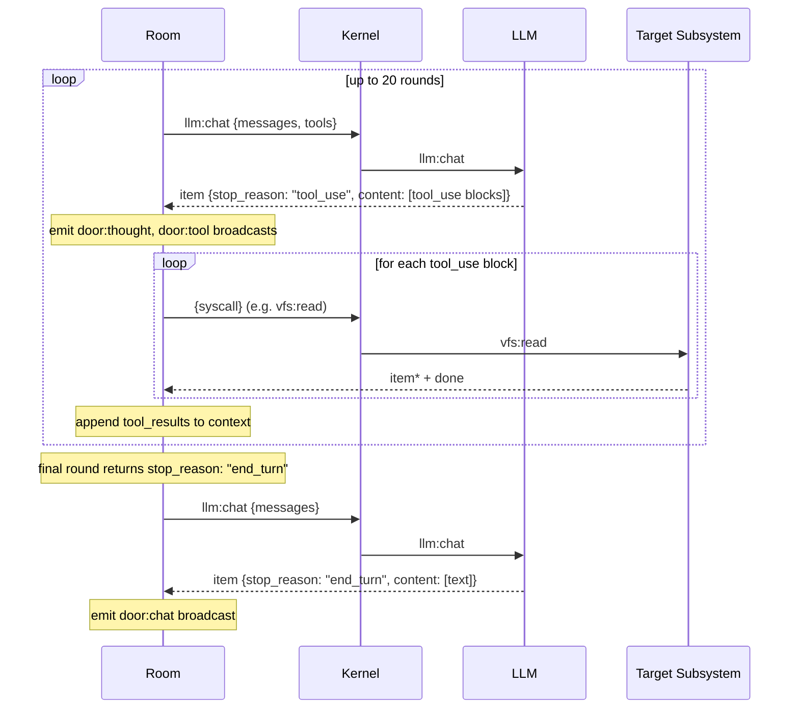
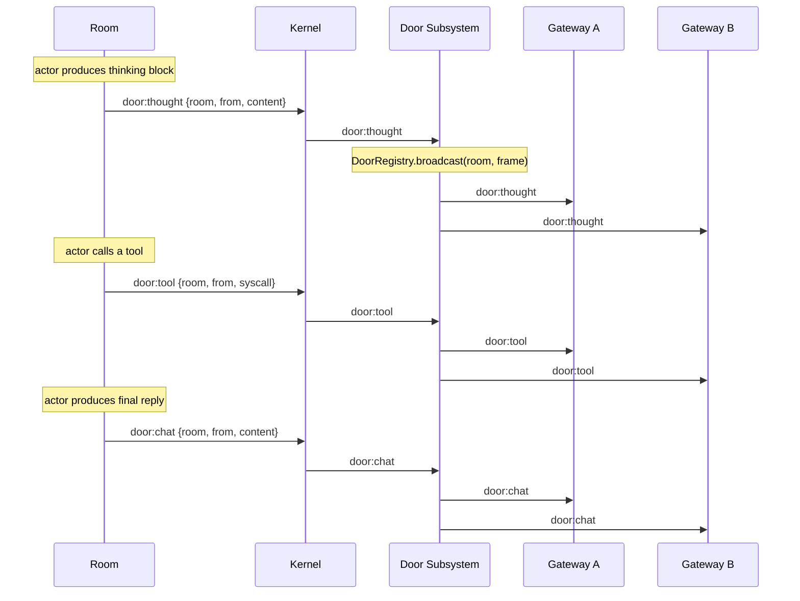
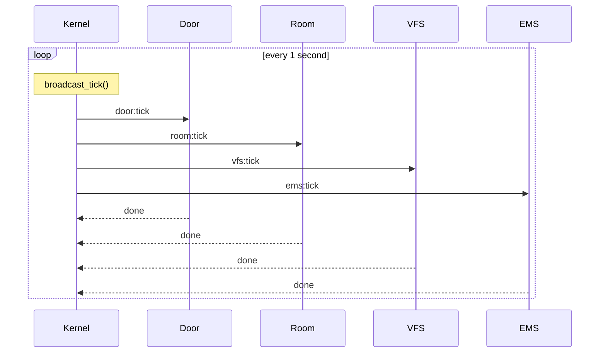
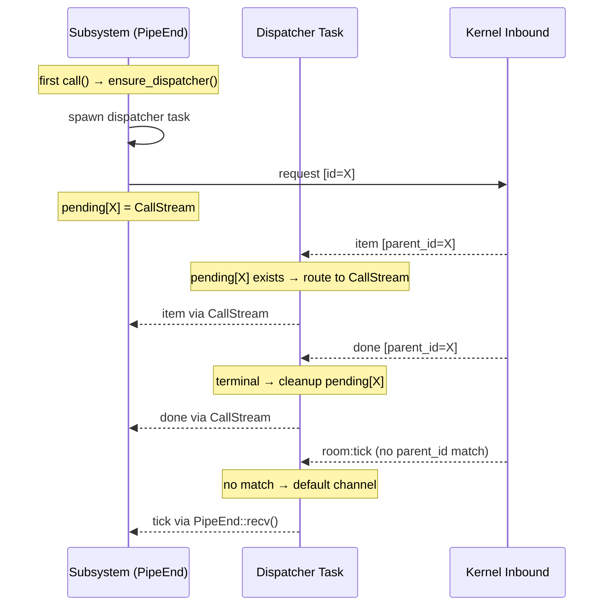
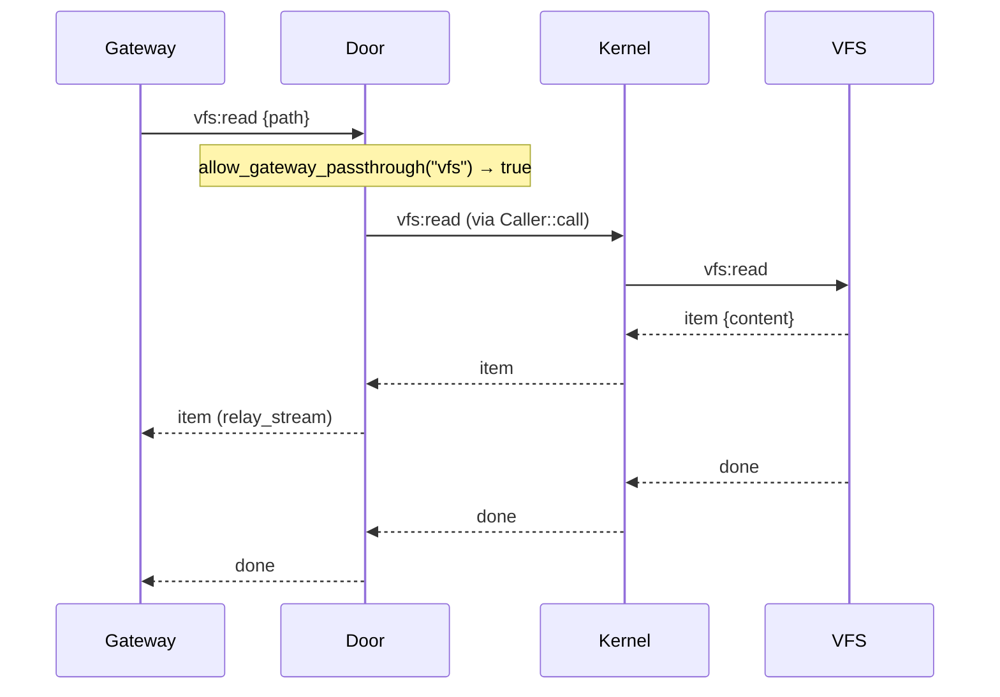
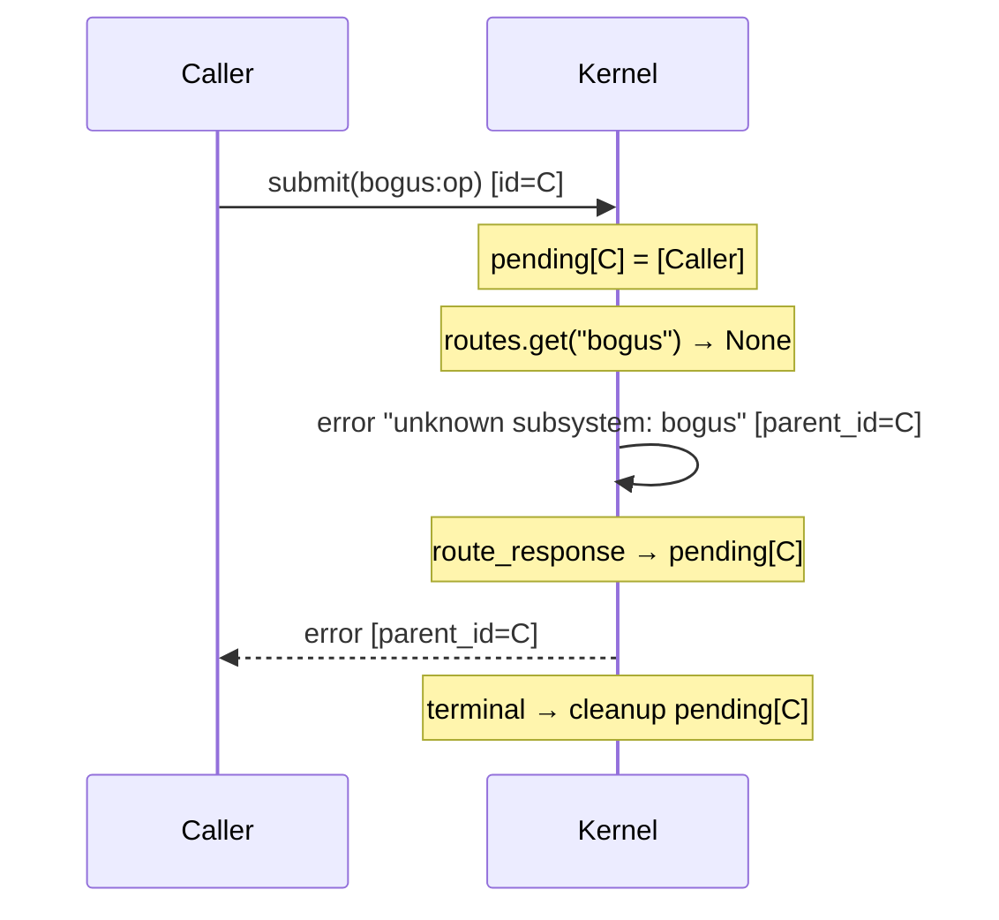

# Frame Sequences

How frames flow through Prior's kernel. Each diagram is a
[Mermaid sequence diagram](https://mermaid.js.org/syntax/sequenceDiagram.html)
rendered natively by GitHub.

---

## 1. Connection Lifecycle

A gateway client connects, joins a room, sends a message, then disconnects.
Door validates sessions and room membership at every step.

---

## 2. Kernel Routing

The kernel's single inbound channel receives every frame. Requests route to
subsystems by syscall prefix. Responses route back to callers by `parent_id`.

---

## 3. Subsystem-to-Subsystem Call

Room acts as both server (handling `room:message`) and client (calling
`llm:chat`). Its pipe bridges responses back through the kernel.

---

## 4. LLM Tool Loop

When the LLM returns `stop_reason: "tool_use"`, Room dispatches tool calls
through the kernel and feeds results back to the LLM. Repeats up to 20 rounds.

---

## 5. Broadcast (door:chat / door:thought / door:tool)

During the actor loop, Room emits fire-and-forget broadcasts via
`Caller::spam()`. These flow through the kernel to Door, which fans them
out to all gateway connections in the target room.

---

## 6. Tick Heartbeat

The kernel sends a tick to every registered subsystem once per second.
Ticks bypass persistence and pending-route tracking.

---

## 7. Pipe Internals

How `PipeEnd` and `Caller` manage call/response correlation through the
lazy dispatcher.

---

## 8. Gateway Passthrough

Non-door syscalls from gateways are forwarded directly through the kernel
after an allowlist check. Door relays the response stream without inspection.

---

## 9. Error Routing

When a request targets an unknown subsystem, the kernel generates an error
response and routes it back through the normal pending mechanism.

